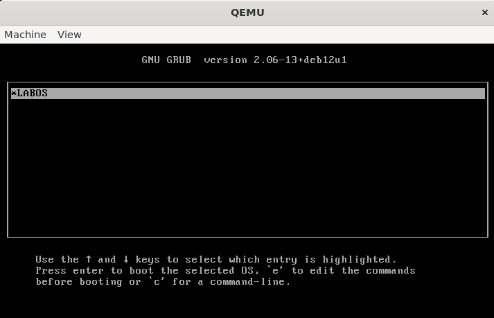
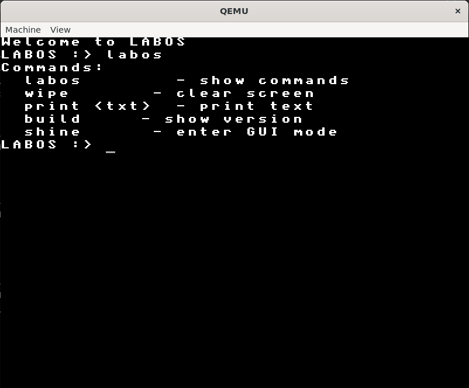
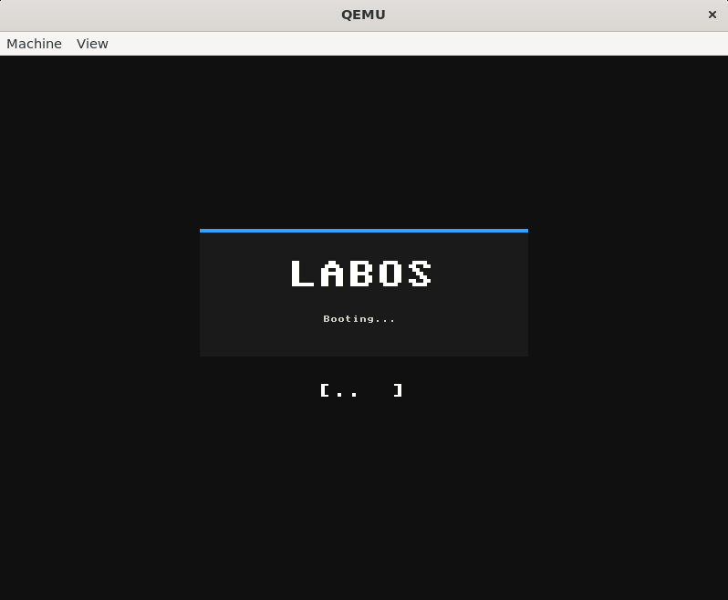
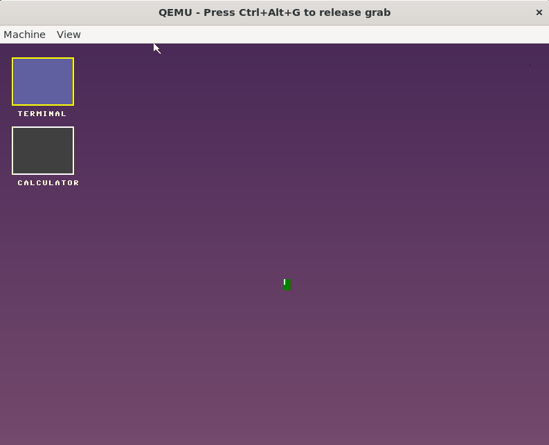
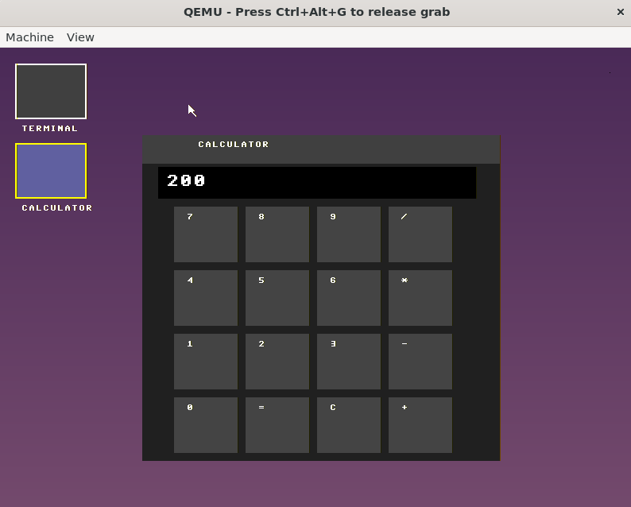

# 🚀 LABOS – A Conceptual Operating System

LABOS is a custom-built operating system developed from scratch, focusing on low-level system design, kernel development, and graphical user interface implementation.

This project demonstrates hands-on experience in OS development, memory handling, GUI systems, and application-level design.

---

## 🧠 Key Highlights

- 🧩 Built a custom bootloader → kernel → shell architecture
- ⚙️ Transitioned from UEFI-based booting to BIOS-compatible system
- 🖥️ Designed a framebuffer-based GUI system
- 🎮 Developed interactive applications inside the OS
- ⌨️ Implemented keyboard-based navigation (Tab support)
- 🧪 Built and tested using QEMU and low-level debugging tools

---

## 🖥️ Features

### 🔹 GUI Desktop Environment
- Custom framebuffer rendering
- Window-based layout
- Application launcher support
- Keyboard navigation using Tab key

---
### 📝 Notepad Application
- Lightweight text editor inside LABOS
- Supports typing and editing text
- 💾 RAM-based save functionality
  - Data is stored temporarily in memory
  - Demonstrates internal memory handling

---
### 🎮 Tic Tac Toe Game
- Fully functional graphical game
- 🖱️ Mouse click support
- ⌨️ Keyboard input support
- 🔙 ESC key integration to return to desktop

---
### 🧭 Navigation System
- Keyboard-driven UI interaction
- Tab-based focus switching between elements
- Improved accessibility without mouse dependency

---
## ⚙️ Tech Stack

- Language: C, Assembly
- Architecture: x86_64
- Boot Mode: BIOS / UEFI (hybrid evolution)
- Graphics: Framebuffer
- Emulation: QEMU
- Web Demo: noVNC + Websockify + ngrok

  ## 🌐 Live Demo

A live demo of LABOS is available and can be accessed on request.

> ⚠️ Due to infrastructure limitations, the demo is hosted dynamically and may not be publicly available 24/7.

📩 Feel free to reach out to request access to the live demo.
Email : shristidwivedi204@gmail.com

---

---
## Screenshots

### GRUB Menu


### Shell Interface


### Boot Screen


### GUI Screen


### Desktop


### Calculator


## How to Run

Run using **QEMU**:

```bash
qemu-system-x86_64 -cdrom dist/x86_64/kernel.iso -vga std
```
or
```bash
qemu-system-x86_64 kernel.iso
```

## 👩‍💻 Author

Shristi  
MCA Student | OS Development Enthusiast | Full Stack Developer  

---

## 📬 Contact

If you'd like to explore LABOS or collaborate:

- LinkedIn: https://www.linkedin.com/in/shristi-dwivedi-938b3823a/
- GitHub: https://github.com/Shristi-Dwivedi/

---

⭐ *If you find this project interesting, consider giving it
