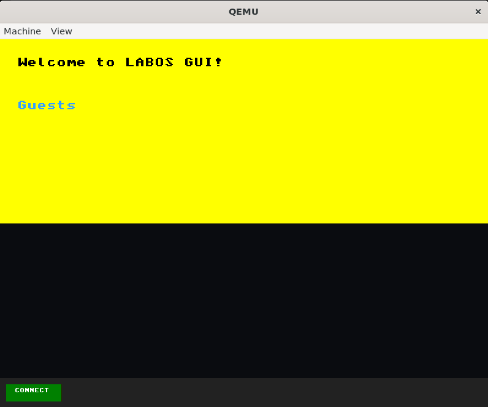

# LABOS : A Conceptual Operating System

LABOS is a bootable operating system built from scratch using **C and Assembly**.  
This project is part of my exploration into **low-level system development, kernels, and OS architecture**.

## Current Development Stage
LABOS is currently in **early development (Alpha stage)**.

## Features Implemented So Far

- Bootloader initialization
- Kernel loading
- Basic screen output
- Simple shell environment
- Command execution framework

## Features In Progress

- GUI system
- Mouse pointer support
- Event handling
- Window manager
- Basic system applications

## Screenshots

### GRUB Menu


### Shell Interface


### Boot Screen


### GUI Screen


## How to Run

Run using **QEMU**:

```bash
qemu-system-x86_64 -cdrom kernel.iso
